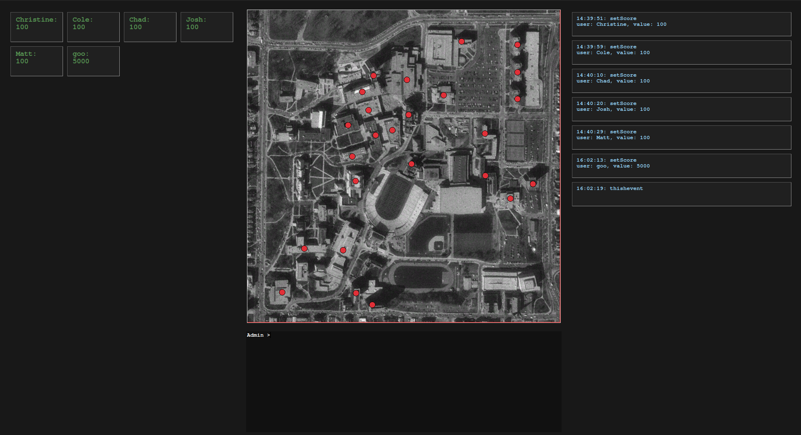

# Admin Console

This is the Admin Console, it is how admins interact with the backend, as well as give visual indications of events happeneing on the network. It is broken into four sections:
* Scoreboard (Left)
* Map (Center)
* Event Stream (Right)
* Terminal (Bottom)

## Scoreboard
The scoreboard visualizes how many points each player on the network has. These points are accumulated by completing tasks or cyber challenges embedded in the network. Scores will automatically be calculated and displayed here.

## Map
The map gives a geographical sense to where users might be on campus. The map is populated with nodes where indicating specific systems in the buildings they cover. When an event occurs at a node (such as a file being manipulated) the node will change color briefly. Competitors may watch the map to get a sense of placement within campus using this method, if they are not familiar with their surroundings.

## Event Stream
The event stream is a scrollable list of events that occurred on the network. Events include scores being distributed, files being manipulated, or support systems malfunctioning. This stream would primarily be used for inspecting user actions, ensuring fair play, and fixing malfunctions.