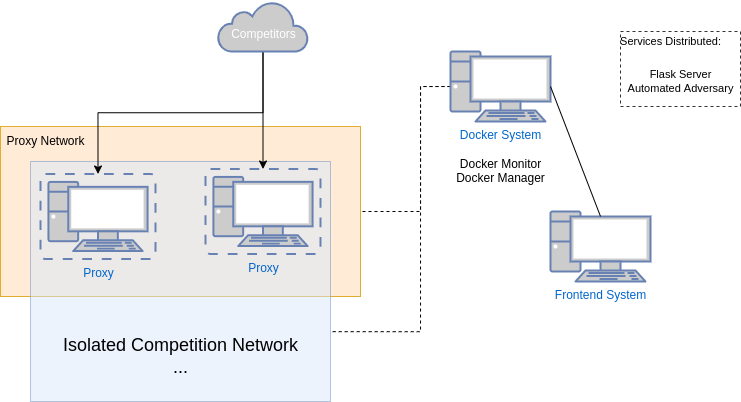
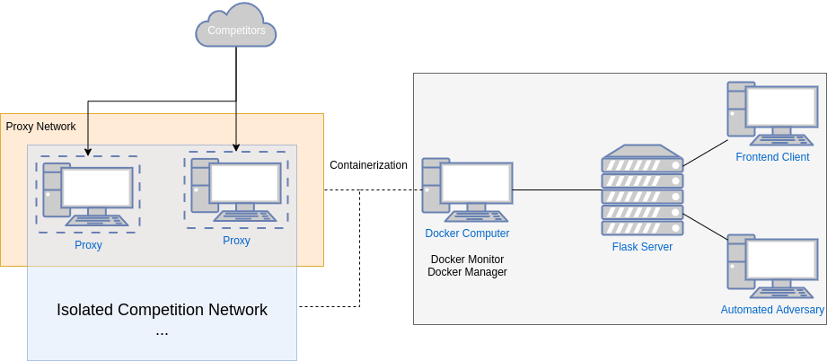

# Distributed Computing
Our Backend and Frontend can be distributed across a variety of computers.
With exception to the Docker Monitor and Manager which must run on the same
machine as the docker containers are run on. The flask server allows for
communication across all of these services.

## Normal Distribution
Our system has been extensively tested distributed across 2 computers. When
they are connected, with one computer being a frontend computer and the other
hosting the isolated container network. The computer running the isolated
container network should also run the Docker Manager and Monitor. The other
backend systems can be distributed across the two computers in any desired
combination.

## Maximum Distribution
The following diagram showcases how one can arrange the backend across four
computers or servers. The frontend can be on any machine, while the flask
server must be able to connect to each of the admin systems. The Docker
Computer must be able to connect others to the competitors.

